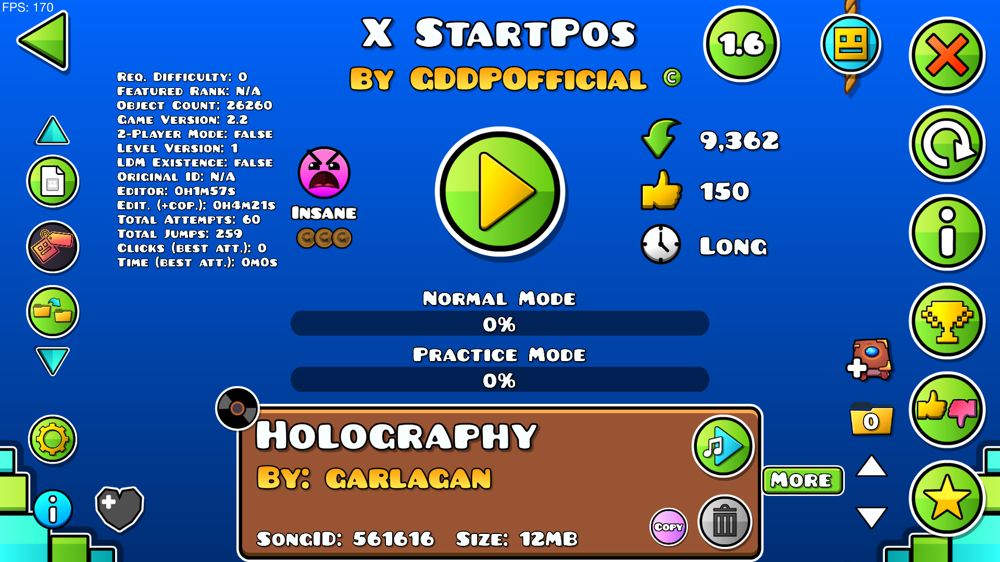
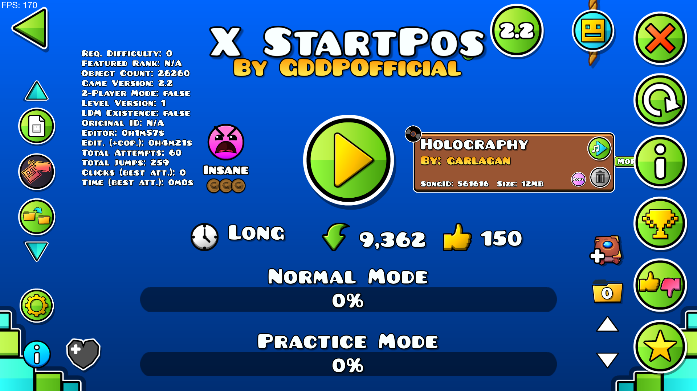
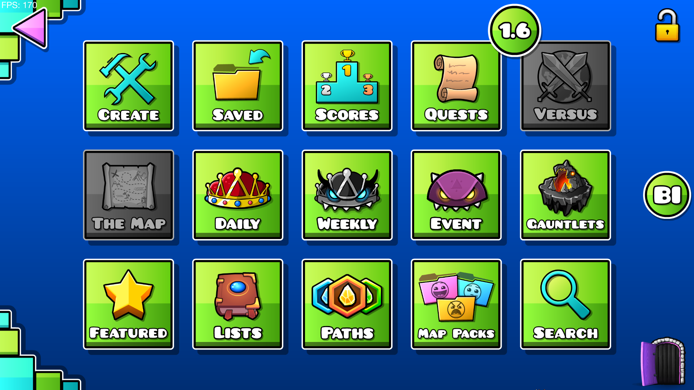
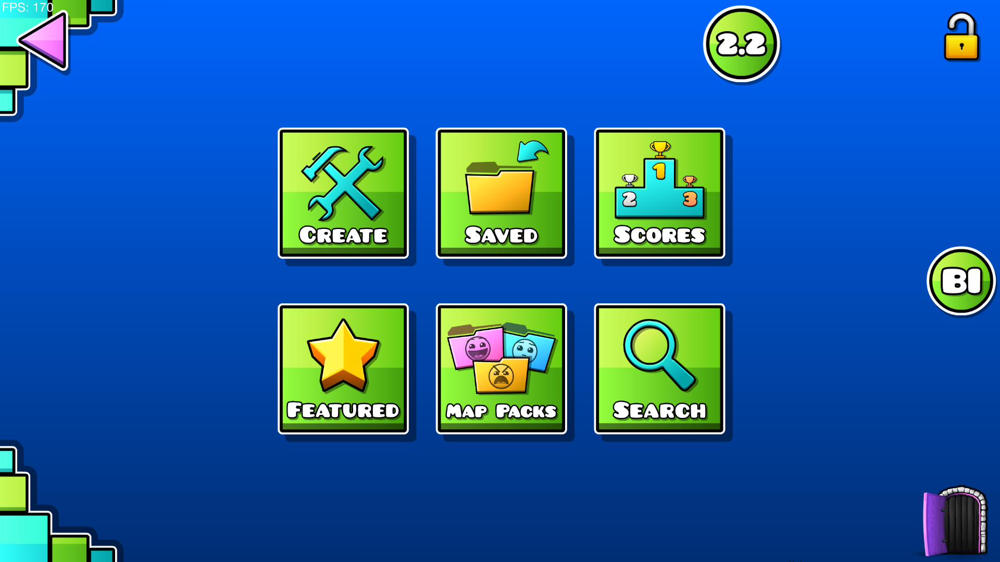
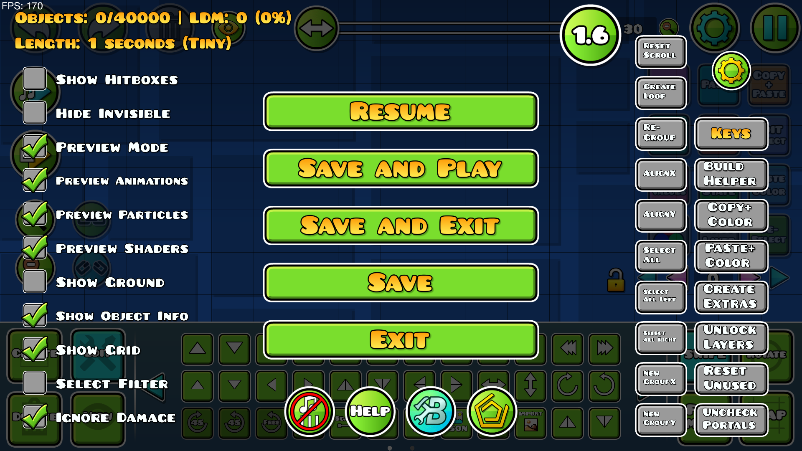
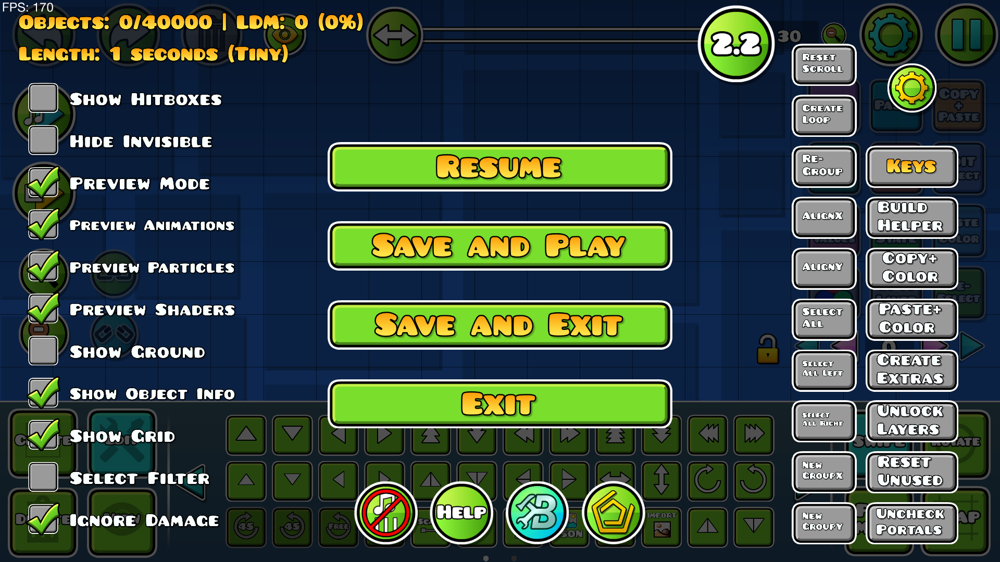

  

      
  

  <h1>Bring Back 1.6!</h1>
  </img>  
  <a href="https://discord.gg/yvvJW2z9zB"></img></a>  
  </img>  

**Bring Back 1.6!** - is a Geometry Dash mod that brings back the nostalgic look and feel of older versions (1.6) to specific UI layers! This mod modifies the `LevelInfoLayer`, `CreatorLayer`, and `EditorPauseLayer` with toggleable "old style" layouts, complete with a handy button to switch between styles on the fly.

Built with <3. Laugh at my "shit code" if you want to! :p

## Features

- **Toggleable Old Style UI**: Switch between modern and retro layouts in real-time with a single button.
- **All Layers**: Adjusts positions, scales, and visibility of elements to mimic older GD versions.
- **Custom Settings**: Option to hide custom songs in `LevelInfoLayer`.

## Installation

1. **Prerequisites**:
   - Install the [Geode SDK](https://geode-sdk.org/) for Geometry Dash.

2. **Download**:
   - Grab the latest release from the [Releases page](https://github.com/noxygalaxy/bringback1.6/). ["Direct Download"](https://github.com/noxygalaxy/bringback1.6/releases/latest/download)

3. **Install**:
   - Place the `.geode` file in your Geometry Dash `mods` folder.
   - Launch Geometry Dash and enable the mod via the Geode mod menu.

4. **Configure**:
   - Open the mod settings in-game to toggle features like `change-levelinfolayer`, `change-creatorlayer`, `change-editorpauselayer`, and `hide-custom-songs`.

## Usage

- Look for the "1.6" button in the top-right corner of modified layers:
- Click it to switch styles instantly—your preference is saved!

## Screenshots

### LevelInfoLayer
- **2.2 Style**  
  
- **1.6 Style**  
  

### CreatorLayer
- **2.2 Style**  
  
- **1.6 Style**  
  

### EditorPauseLayer
- **2.2 Style**  
  
- **1.6 Style**  
  

---

## Settings

Customize the mod via the Geode settings menu:
- `Modify Level Info Layer`: Enable/disable changes to `LevelInfoLayer`.
- `Modify Creator Layer`: Enable/disable changes to `CreatorLayer`.
- `Modify Editor Pause Layer`: Enable/disable changes to `EditorPauseLayer`.
- `Hide Song Widget`: Hide the custom songs widget in `LevelInfoLayer` when in old style.

---

## Development

The mod hooks into `LevelInfoLayer`, `CreatorLayer`, and `EditorPauseLayer` to:
- Store original UI states.
- Apply custom positions/scales/visibility for "old style."
- Restore defaults when toggled off.

Check out the source code to see bad code but functional! :P Contributions welcome.

---

## Credits

- **Developer**: [noxygalaxy](https://github.com/noxygalaxy)
- **Inspiration**: Nostalgia for Geometry Dash 1.6.
